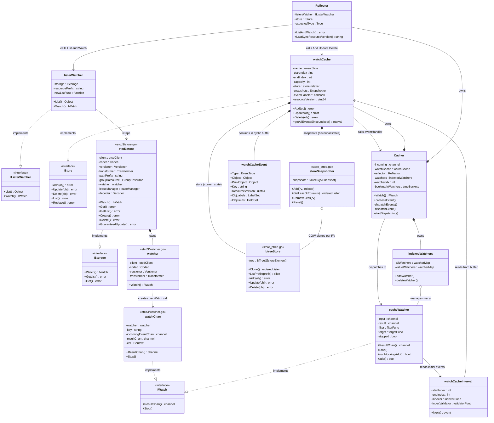
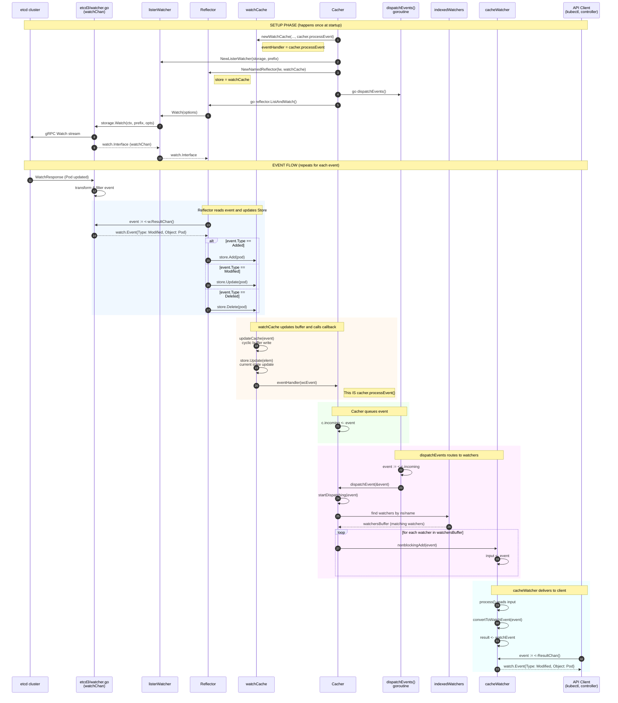
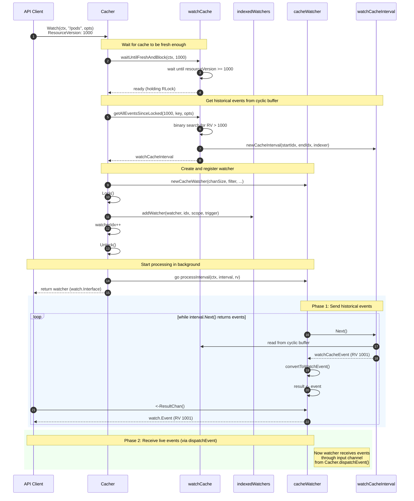
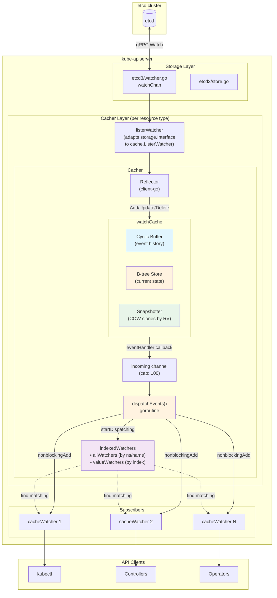
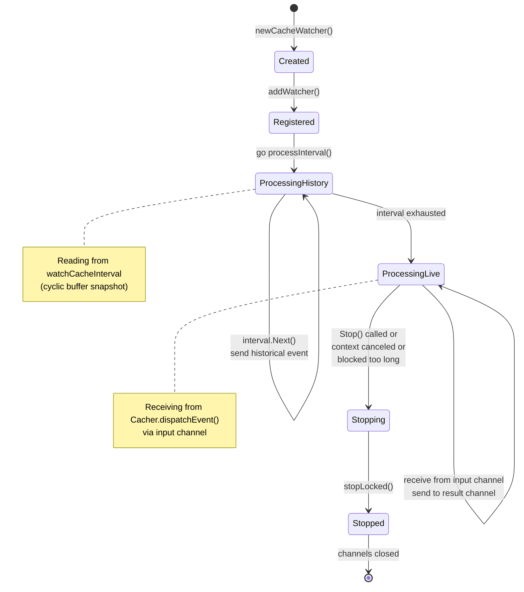
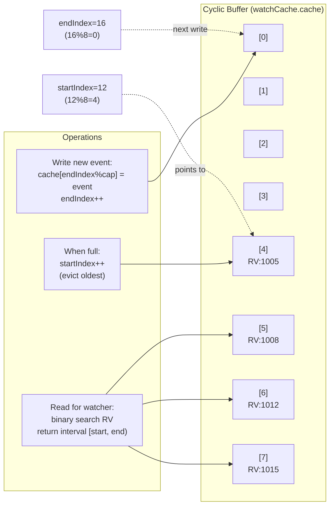
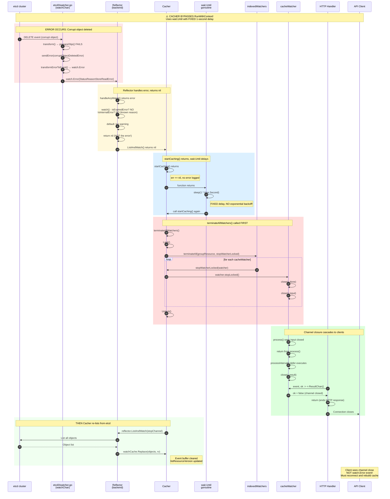
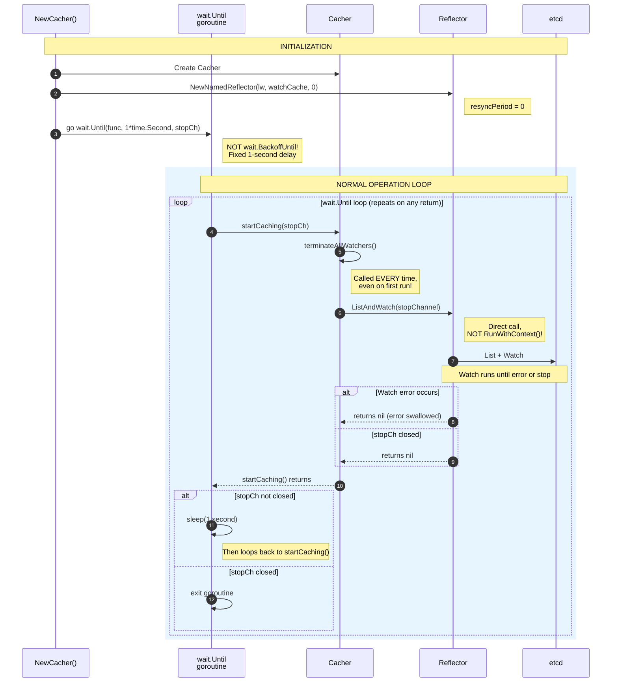
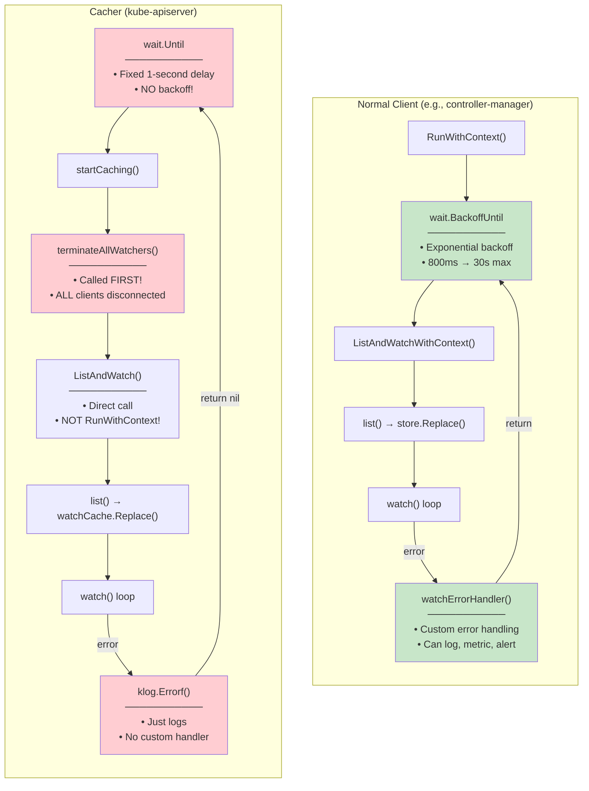

# etcd3 Watcher Architecture — UML Diagrams

This document contains UML diagrams explaining how the Kubernetes API server watches etcd
and distributes events to subscribers.

---

## 1. Class/Struct Diagram — Component Relationships

This diagram shows how the main structs relate to each other.



---

## 2. Sequence Diagram — Event Flow from etcd to Client

This diagram shows the runtime flow when an event occurs in etcd.



---

## 3. Sequence Diagram — New Watch Subscription

This diagram shows what happens when a new client starts watching.



---

## 4. Component Diagram — High-Level Architecture



---

## 5. State Diagram — cacheWatcher Lifecycle



---

## 6. Data Flow Diagram — Cyclic Buffer Operations



---

## 7. Sequence Diagram — Cache Reset and Watcher Termination

This diagram shows what happens when an error (e.g., corrupt object deletion) causes
the Cacher to reset. **Important:** The Cacher bypasses `RunWithContext` and calls
`ListAndWatch` directly, using `wait.Until` for retry logic.



---

## 8. Sequence Diagram — Cacher Startup Loop (wait.Until Pattern)

This diagram emphasizes the Cacher's unique retry pattern that differs from normal
Reflector usage.



---

## 9. Comparison Diagram — Cacher vs Normal Client Reflector Usage



---

## How to Render These Diagrams

### Option 1: GitHub/GitLab
Simply view this `.md` file in GitHub or GitLab — they render Mermaid natively.

### Option 2: VS Code
Install the "Markdown Preview Mermaid Support" extension.

### Option 3: Online
Copy the Mermaid code blocks to [mermaid.live](https://mermaid.live/)

### Option 4: Command Line
```bash
# Install mermaid-cli
npm install -g @mermaid-js/mermaid-cli

# Generate PNG
mmdc -i etcd3-watcher-uml-diagrams.md -o diagrams.png
```

---

## Key Insights from the Diagrams

1. **Interface Boundaries**: Notice how each major component communicates through well-defined interfaces (`watch.Interface`, `cache.Store`, `cache.ListerWatcher`). This allows components to be tested and replaced independently.

2. **Callback Pattern**: The `watchCache.eventHandler` callback is the key bridge between the storage layer and the distribution layer. It's set during initialization and decouples the two concerns.

3. **Two-Phase Watch**: New watchers first read from `watchCacheInterval` (historical), then switch to receiving from `input` channel (live). This ensures no events are missed.

4. **Fan-Out Architecture**: One etcd watch stream fans out to many `cacheWatcher` instances, each with its own filter. This is why the API server can handle thousands of watch connections efficiently.

5. **Three-Part watchCache**: The watchCache has three distinct components:
   - **Cyclic Buffer**: Stores event history for WATCH requests ("what changed since RV X?")
   - **B-tree Store**: Stores current objects for LIST requests ("what exists now?")
   - **Snapshotter**: Stores COW clones for exact-RV LIST requests ("what existed at RV X?")

   This separation allows each query pattern to be served by an optimized data structure.

6. **Copy-on-Write Snapshots**: The `storeSnapshotter` creates O(1) snapshots via B-tree Clone(). After each event, a COW clone is created—both the original and clone share nodes until one is modified. This enables serving LIST requests at specific resource versions without expensive deep copies. (Requires `ListFromCacheSnapshot` feature gate.)

7. **Cacher Bypasses RunWithContext**: Unlike normal clients that use `RunWithContext()` with exponential backoff, the Cacher directly calls `ListAndWatch()` and manages its own retry loop with `wait.Until`. This means:
   - **Fixed 1-second delay** between retries (no exponential backoff)
   - **No `watchErrorHandler`** is called (errors just logged)
   - **`terminateAllWatchers()` called on EVERY restart** — all clients disconnected before re-listing

8. **terminateAllWatchers Cascade**: When the Cacher resets (for any reason), the termination cascades:
   ```
   terminateAllWatchers() → stopLocked() → close(input) → process() returns
                         → close(result) → HTTP handler returns → client disconnected
   ```
   Clients see their watch channel close but receive NO `watch.Error` event explaining why.

9. **Error Classification Affects Retry**: The `StatusReasonStoreReadError` used for corrupt objects is in the `knownReasons` map, so `IsInternalError()` returns `false`. This prevents the internal retry mechanism from kicking in, causing the watch to end immediately.
