# Client-Side Informer Architecture — UML Diagrams

This document contains UML diagrams explaining how Kubernetes controllers watch the
API server using SharedInformers, DeltaFIFO, and Reflector.

---

## 1. Class/Struct Diagram — Component Relationships

This diagram shows how the main client-side components relate to each other.

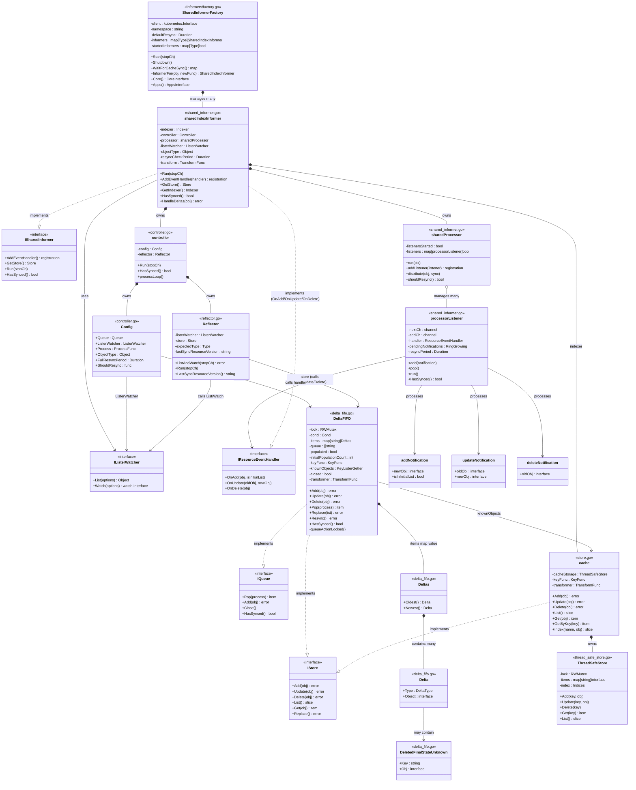

---

## 2. Sequence Diagram — Event Flow from API Server to Handler

This diagram shows the runtime flow when an object changes in the API server.

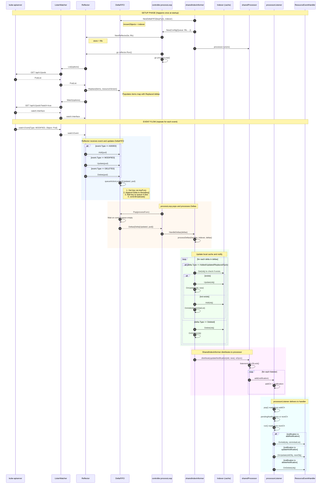

---

## 3. DeltaFIFO Internal Structure — Data Flow Diagram

This diagram shows how DeltaFIFO maintains its internal state.

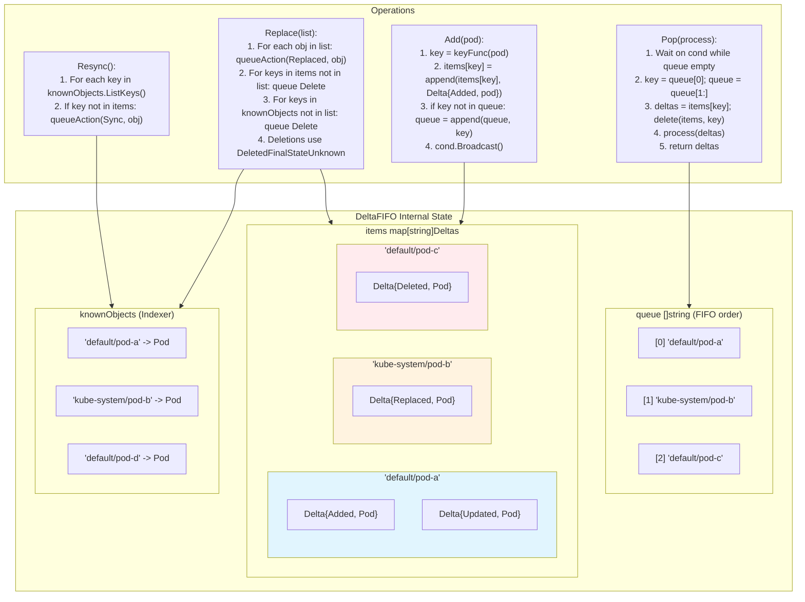

---

## 4. Sequence Diagram — DeltaFIFO Accumulation

This diagram shows how multiple events for the same object are accumulated.

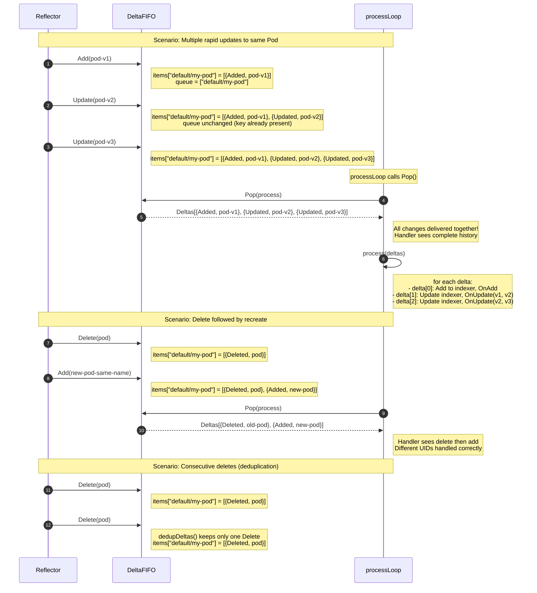

---

## 5. Component Diagram — High-Level Client Architecture

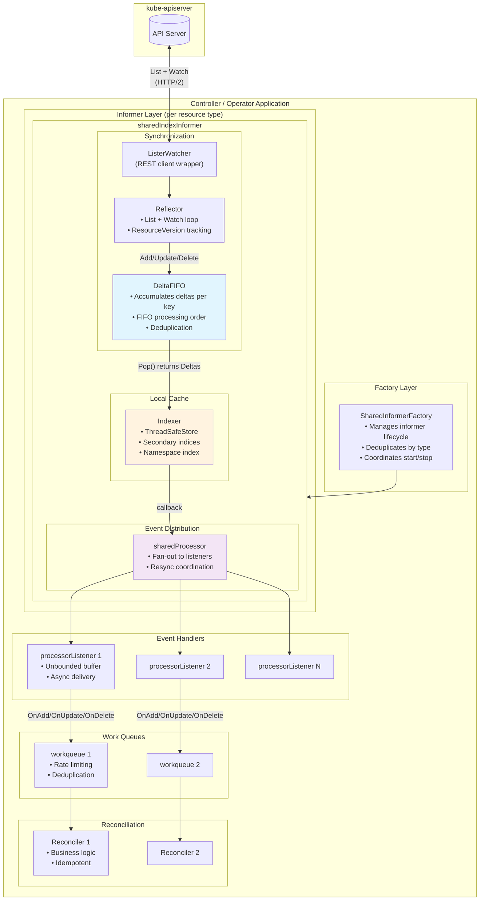

---

## 6. State Diagram — DeltaFIFO Lifecycle

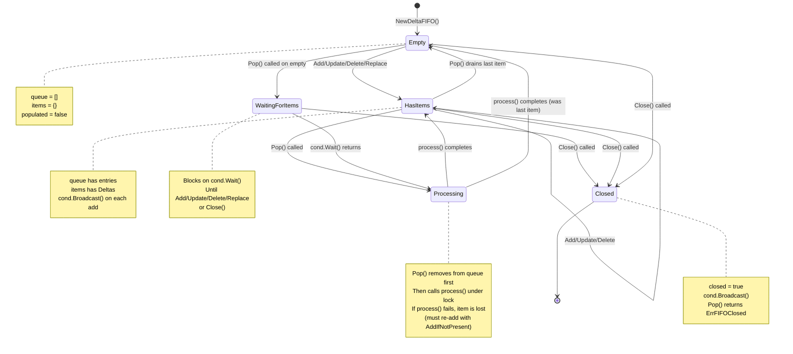

---

## 7. Sequence Diagram — Replace (Relist) Operation

This shows what happens during a relist (after watch disconnect).

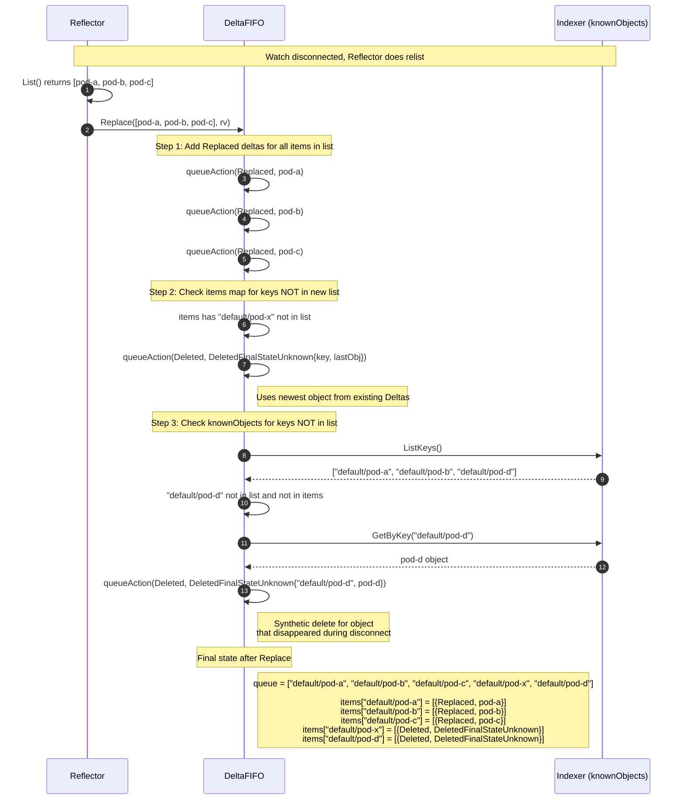

---

## 8. Delta Types — When Each Is Used

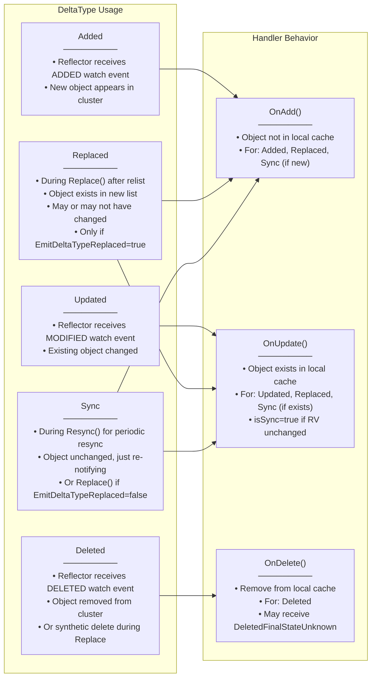

---

## 9. processorListener — Two-Goroutine Architecture

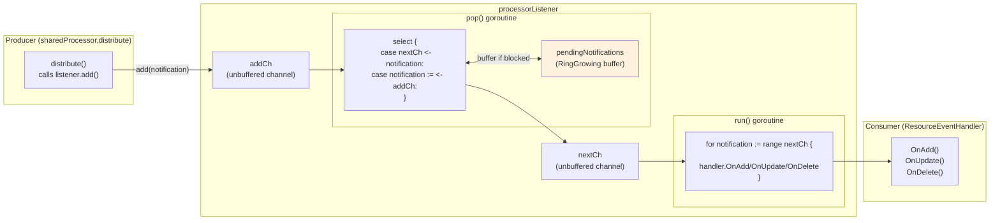

**Why two goroutines?**
- `pop()` ensures the producer (sharedProcessor) never blocks
- `run()` can take as long as needed for handler execution
- `pendingNotifications` ring buffer grows unboundedly if handler is slow
- This prevents slow handlers from blocking other listeners

---

## 10. Sequence Diagram — Watch Reconnection After Server-Side Channel Close

This diagram shows what happens on the **client side** when the API server terminates the watch connection (e.g., due to a corrupt object error in the server-side Cacher).

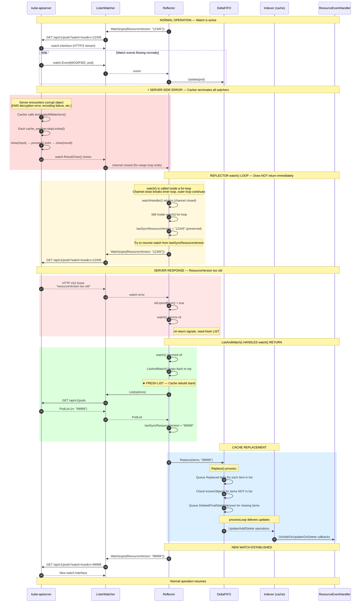

### Key Points About Client-Side Reconnection

| Step | What Happens | Why It Matters |
|------|--------------|----------------|
| 1. Channel closes | `watch.ResultChan()` closes, breaking `for-range` in `watchHandler()` | Does NOT immediately trigger cache rebuild |
| 2. watch() loops | Tries to resume from `lastSyncResourceVersion` | Client hopes to continue where it left off |
| 3. "too old" error | Server's `watchCache` was replaced, old RV is gone | This triggers the relist |
| 4. watch() returns nil | Signals to `ListAndWatch()`: retry needed | Different from error return |
| 5. Fresh LIST | Gets current state from server | Cache fully rebuilt |
| 6. Replace() | DeltaFIFO reconciles new list with local cache | `DeletedFinalStateUnknown` for vanished objects |

---

## 11. Flowchart — Reflector watch() Return Behavior

This diagram clarifies when `watch()` returns vs loops internally.

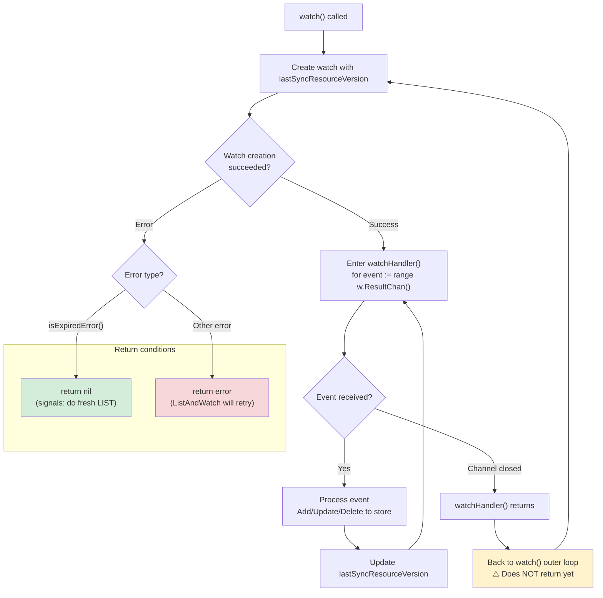

### ⚠️ Critical Understanding

The `watch()` function in `reflector.go` has this structure:

```go
func (r *Reflector) watch(options metav1.ListOptions, ...) error {
    for {  // ← OUTER LOOP - keeps trying
        w, err := r.listerWatcher.Watch(options)
        if err != nil {
            if isExpiredError(err) {
                return nil  // ← Only returns here
            }
            // ... other error handling
            return err
        }

        err = watchHandler(w, ...)  // ← Blocks until channel closes
        // Channel close: watchHandler returns, loop continues
        // ↓ Goes back to top of for-loop, tries another Watch()
    }
}
```

The channel closing does NOT cause `watch()` to return. It just causes the inner `watchHandler()` to return, and the outer loop tries again.

---

## How to Render These Diagrams

### Option 1: GitHub/GitLab
Simply view this `.md` file in GitHub or GitLab — they render Mermaid natively.

### Option 2: VS Code
Install the "Markdown Preview Mermaid Support" extension.

### Option 3: Online
Copy the Mermaid code blocks to [mermaid.live](https://mermaid.live/)

### Option 4: Command Line
```bash
# Install mermaid-cli
npm install -g @mermaid-js/mermaid-cli

# Generate PNG
mmdc -i client-side-informer-uml-diagrams.md -o diagrams.png
```

---

## Key Insights from the Diagrams

1. **DeltaFIFO as Accumulator**: Unlike a simple queue, DeltaFIFO accumulates ALL changes to an object between Pop() calls. If a Pod is created then updated 5 times before the handler processes it, the handler sees all 6 deltas in one Pop().

2. **DeletedFinalStateUnknown**: When a watch disconnects and objects disappear during relist, DeltaFIFO synthesizes delete events. The object in these events may be stale (the last known state), wrapped in `DeletedFinalStateUnknown` to signal handlers should handle it carefully.

3. **knownObjects Bridge**: DeltaFIFO's `knownObjects` reference to the Indexer is crucial for detecting deletions during Replace(). Without it, objects deleted during a watch disconnect would be silently lost.

4. **Two-Phase Processing**: The controller's `processLoop` first updates the local cache (Indexer), THEN notifies handlers. This ensures handlers always see consistent cache state when they query it.

5. **Fan-Out with Backpressure**: Each `processorListener` has its own unbounded buffer (`pendingNotifications`). A slow handler only affects its own memory usage, not other handlers. But beware: a consistently slow handler will eventually OOM the process.

6. **Sync vs Replaced**: The distinction matters for handlers that want to differentiate "object changed" from "we're just resyncing." Check `isSync` in `OnUpdate()` to skip unnecessary work during resync.

7. **Channel Close ≠ Immediate Relist**: When the server closes a watch channel, the client's `watchHandler()` returns, but `watch()` does NOT return. It loops back and tries to resume from `lastSyncResourceVersion`. Only when the server responds with "too old" does `watch()` return `nil`, triggering a fresh LIST.

8. **The "Too Old" Error is the Trigger**: The critical moment that causes cache rebuild is receiving `HTTP 410 Gone` (resource version too old) from the server, NOT the channel closing. The client optimistically tries to resume first.

9. **Server-Side Cache Reset Causes Client-Side Cache Rebuild**: When the server's Cacher calls `terminateAllWatchers()` and does a fresh `ListAndWatch()`, its `watchCache` gets new resource versions. Old client watches become invalid, forcing ALL connected clients to relist and rebuild their caches.

10. **Cascade of Rebuilds**: A single corrupt object error on the server triggers: (1) server cache reset, (2) all client watch channels close, (3) all clients get "too old" error, (4) all clients do fresh LIST, (5) all client caches rebuild. This is a cluster-wide impact for that resource type.
